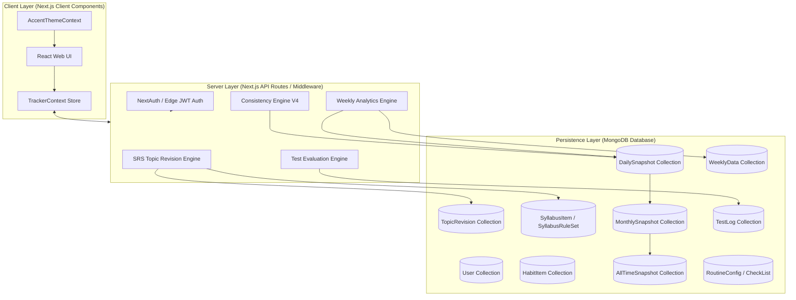
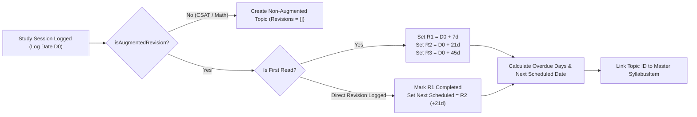
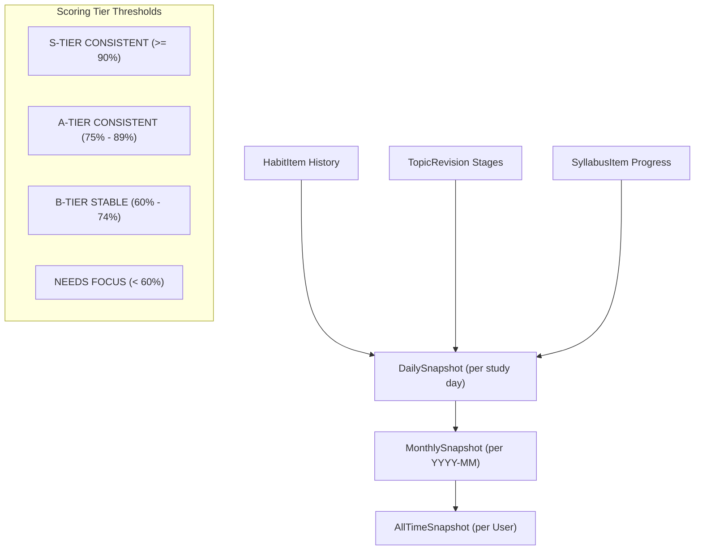
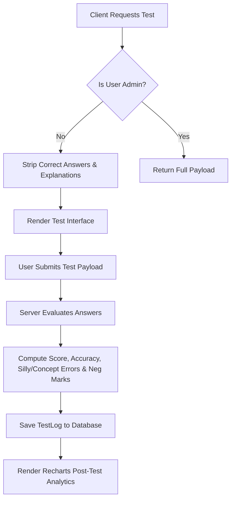

# UPSC Tracker — Spaced Repetition & Exam Assessment Platform

[](https://nextjs.org/)
[](https://www.typescriptlang.org/)
[](https://www.mongodb.com/)
[](LICENSE)

An open-source, full-stack study management, spaced repetition system (SRS), and test hosting platform engineered specifically for **UPSC Civil Services Examination (CSE)** aspirants. 

Built with **Next.js (App Router)**, **TypeScript**, **MongoDB/Mongoose**, and **Tailwind CSS**, this platform features an automated **3-Tier Consistency Engine**, **Asymmetric SRS Spaced Repetition**, **Weekly Velocity Analytics**, **Interactive Timetable & Habit Tracking**, and **Secure Server-Side Test Evaluation**.

---

## 📑 Table of Contents

1. [Architectural Overview](#-architectural-overview)
2. [Entity Relationship Diagram (ERD)](#-entity-relationship-diagram-erd)
3. [Comprehensive Feature Documentation & Business Logic](#-comprehensive-feature-documentation--business-logic)
   - [1. Spaced Repetition System (SRS) Revision Engine](#1-spaced-repetition-system-srs-revision-engine)
   - [2. Consistency Engine V4 & 3-Tier Snapshot Pipeline](#2-consistency-engine-v4--3-tier-snapshot-pipeline)
   - [3. Weekly Velocity & Study Analytics Engine](#3-weekly-velocity--study-analytics-engine)
   - [4. Test Hosting & Secure Server-Side Assessment Engine](#4-test-hosting--secure-server-side-assessment-engine)
   - [5. Master Syllabus Hierarchy & Dynamic Rule Engine](#5-master-syllabus-hierarchy--dynamic-rule-engine)
   - [6. Habit & Task Tracking with Streak Engine](#6-habit--task-tracking-with-streak-engine)
   - [7. Routine Timetable, Schedule & Checklist System](#7-routine-timetable-schedule--checklist-system)
   - [8. Multi-Tonal Adaptive Neon Theme System](#8-multi-tonal-adaptive-neon-theme-system)
   - [9. Data Backup, Export & Import Pipeline](#9-data-backup-export--import-pipeline)
   - [10. Landing Page Architecture & Feature Showcase Mapping](#10-landing-page-architecture--feature-showcase-mapping)
   - [11. High-Performance Production & Database Optimizations](#11-high-performance-production--database-optimizations)
4. [API Route Reference](#-api-route-reference)
5. [Getting Started & Local Development](#-getting-started--local-development)
6. [Open Source Contribution Guidelines](#-open-source-contribution-guidelines)

---

## 🏗 Architectural Overview

The application follows a decoupled client-server architecture powered by Next.js App Router and MongoDB via Mongoose. The frontend is fully decoupled from hardcoded theme colors using OKLCH-calibrated CSS custom properties (`--accent`, `--accent-primary`, etc.), allowing real-time multi-tonal dynamic themes.



---

## 🧬 Entity Relationship Diagram (ERD)

The database consists of 13 primary Mongoose schemas linked logically via `userId` and custom record identifiers.

```mermaid
erDiagram
    USER ||--o{ HABIT_ITEM : owns
    USER ||--o{ TOPIC_REVISION : tracks
    USER ||--o{ SYLLABUS_ITEM : maintains
    USER ||--o{ TEST_LOG : executes
    USER ||--o{ DAILY_SNAPSHOT : aggregates
    USER ||--o{ MONTHLY_SNAPSHOT : compiles
    USER ||--o{ ALL_TIME_SNAPSHOT : summarizes
    USER ||--o{ WEEKLY_DATA : computes
    USER ||--o{ ROUTINE_CONFIG : configures
    USER ||--o{ CHECKLIST : lists

    USER {
        string _id PK
        string email
        string name
        string picture
        string passwordHash
        string role
        date createdAt
    }

    HABIT_ITEM {
        string _id PK
        string userId FK
        string type "habit | task | event"
        string title
        object category
        string priority "low | medium | high"
        object frequency
        object target
        string startDate
        string endDate
        boolean isStudyTask
        boolean isAugmentedRevision
        string subject
        string topic
        number streakCurrent
        number streakBest
        array history
    }

    TOPIC_REVISION {
        string _id PK
        string userId FK
        string customId
        string subject
        string category
        string topic
        string firstReadDate
        string lastRevisedDate
        string status
        boolean isAugmentedRevision
        string nextScheduledDate
        boolean isOverdue
        number overdueDays
        array revisions
    }

    SYLLABUS_ITEM {
        string _id PK
        string userId FK
        string customId
        string subject
        string category
        string status
        string source
        string date
        string nextRev
        array rules
        array topicRevisionIds
    }

    TEST_LOG {
        string _id PK
        string userId FK
        string customId
        string testName
        string code
        string type "PRELIMS | MAINS | CSAT"
        string category
        string subject
        string accuracy
        mixed score
        mixed maxScore
        number percent
        number correctCount
        number incorrectCount
        number unattemptedCount
        number negMarks
        number durationMins
        array weakAreas
        string takeaway
        string date
    }

    DAILY_SNAPSHOT {
        string _id PK
        string userId FK
        string studyDayKey "YYYY-MM-DD"
        string monthKey "YYYY-MM"
        string monthName
        number habitScore
        number taskScore
        number revisionScore
        number overallScore
        array habitBreakdown
        array categoryBreakdown
        array subjectBreakdown
    }

    MONTHLY_SNAPSHOT {
        string _id PK
        string userId FK
        string monthKey "YYYY-MM"
        string monthName
        number overallScore
        number habitScore
        number taskScore
        number revisionScore
        number daysWithData
        array habitBreakdown
        array categoryBreakdown
        array subjectBreakdown
    }

    ALL_TIME_SNAPSHOT {
        string _id PK
        string userId FK
        number overallScore
        number habitScore
        number taskScore
        number revisionScore
        number totalDaysRecorded
        array habitBreakdown
        array categoryBreakdown
        array subjectBreakdown
    }

    WEEKLY_DATA {
        string _id PK
        string userId FK
        string weekKey "YYYY-MM-DD_to_YYYY-MM-DD"
        string startDate
        string endDate
        number weeklyTotalHours
        number dailyAverageHours
        number consistencyPct
        number totalTasksDone
        array weeklyData
        array subjectDistribution
        array habitDistribution
    }

    ROUTINE_CONFIG {
        string _id PK
        string userId FK
        string title
        string subtitle
        mixed timeSlots
        mixed cells
        mixed metrics
        mixed satakGoals
        mixed tables
    }

    CHECKLIST {
        string _id PK
        string userId FK
        string title
        string color
        array items
    }
```



---

## 🔬 Comprehensive Feature Documentation & Business Logic

### 1. Spaced Repetition System (SRS) Revision Engine

**Module**: `src/lib/topicRevisionEngine.ts` & `src/models/TopicRevision.ts`

#### Business Logic & Algorithm
The SRS engine automates revision scheduling for UPSC syllabus topics. When an aspirant completes an initial study session for a topic:
1. **First Read**: Logged at date $D_0$.
2. **Revision 1 (R1)**: Scheduled at $D_0 + 7\text{ days}$.
3. **Revision 2 (R2)**: Scheduled at $D_0 + 21\text{ days}$.
4. **Revision 3 (R3)**: Scheduled at $D_0 + 45\text{ days}$.

#### CSAT & Mathematics Exemption Rule
Topics belonging to non-memorization categories (such as CSAT, Quantitative Aptitude, or Logical Reasoning) can have `isAugmentedRevision = false`. For these topics, the `revisions` array remains empty `[]`, disabling revision decay penalties.

#### Overdue Status Calculation
$$\text{diffDays} = \text{differenceInCalendarDays}(D_{\text{current}}, D_{\text{scheduled}})$$
$$\text{isOverdue} = \begin{cases} \text{true} & \text{if } \text{diffDays} > 0 \\ \text{false} & \text{otherwise} \end{cases}$$



---

### 2. Consistency Engine V4 & 3-Tier Snapshot Pipeline

**Module**: `src/lib/consistencyEngineV3.ts`  
**API Endpoints**: `/api/tracker/consistency` | `/api/tracker/consistency/recalculate`

#### 2.1 Academic Day Reset (4:00 AM Boundary)
To accommodate late-night UPSC study schedules, the academic day key shifts at **4:00 AM**:
$$\text{studyDayKey}(t) = \begin{cases} \text{formatDate}(t - 1\text{ day}) & \text{if } \text{getHours}(t) < 4 \\ \text{formatDate}(t) & \text{if } \text{getHours}(t) \ge 4 \end{cases}$$

#### 2.2 Composite Daily Scoring Equation
The Daily Composite Score balances habits, tasks, and SRS revisions:
$$\text{OverallScore} = \frac{0.40 \times S_{\text{Habit}} + 0.30 \times S_{\text{Task}} + 0.30 \times S_{\text{Revision}}}{\sum W_{\text{active}}}$$

* **Dynamic Weight Redistribution**: If a component has no scheduled items ($Score = -1$), its weight redistributes proportionally among remaining active components.

#### 2.3 Habit Score (40% Weight)
For each scheduled habit where $startDate \le \text{studyDayKey}$:
$$S_{\text{Habit}} = \left( \frac{\text{Completed Scheduled Habits}}{\text{Total Scheduled Habits}} \right) \times 100$$

#### 2.4 Asymmetric Revision Scoring (30% Weight)
Revision scoring uses asymmetric weights to heavily reward on-time completion while imposing a strict penalty for missed deadlines:
* $W_{\text{DONE}} = 1.0$ (Credit for completed revision)
* $W_{\text{MISS}} = 1.3$ (Penalty for missed revision — 30% harsher penalty)
* $GRACE\_DAYS = 1$ (1-day grace period before marking overdue items as missed)

$$S_{\text{Revision}} = \text{clamp}\left(0, 100, \left( \frac{N_{\text{done}} \times 1.0 - N_{\text{missed}} \times 1.3}{N_{\text{due}}} \right) \times 100 \right)$$

#### 2.5 3-Tier Snapshot Pipeline & Item-Specific Off-Day Trend Filtering


* **Item-Specific Inactive Date Filtering**: When drilling down into a specific Habit (e.g. `Gym`), Category (e.g. `GS1` / `MATHS`), or Subject (e.g. `Polity`), dates with no scheduled revisions, habits, or readings are omitted from the trend graph array. This prevents artificial score drops on off-days while accurately plotting 100% completion on active days.
* **Global Loading State Parity**: All API calls, habit toggles, focus timer logs, and list modifications provide immediate UI visual feedback using animated `Loader2` spinners, header sync pills (`Syncing to DB...`), and skeleton placeholders to guarantee zero UI freezing.

---

### 3. Weekly Velocity & Study Analytics Engine

**Module**: `src/lib/weeklyAnalyticsEngine.ts`  
**API Endpoint**: `/api/tracker/weekly-analytics`

#### Business Logic & Calculation Rules
1. **7-Day Rolling Window**: Aggregates study data from the preceding 7 days ($Mon \to Sun$).
2. **Study Hours Normalization**: Converts minutes and hour inputs into decimal hours:
   $$\text{Hours}(entry) = \begin{cases} \text{value} & \text{if unit } \in \{\text{hrs, hours}\} \\ \frac{\text{value}}{60} & \text{if unit } \in \{\text{mins, minutes}\} \\ \frac{\text{durationMinutes}}{60} & \text{if unit is task default} \end{cases}$$
3. **Weekly Habit Consistency Rule**: A habit is classified as **consistent** if it was completed on $\ge 2 \text{ days}$ during the 7-day window.
   $$\text{ConsistencyPct} = \left( \frac{\text{Count of Habits with completedDays } \ge 2}{\text{Total Recurring Habits}} \right) \times 100$$
4. **Subject Distribution Percentage**:
   $$Pct_{\text{subject}} = \left( \frac{\text{Hours}_{\text{subject}}}{\text{Total Study Hours}} \right) \times 100$$

---

### 4. Test Hosting & Secure Server-Side Assessment Engine

**Module**: `/src/app/api/tracker/test` & `/src/models/TestLog.ts`

#### Features & Modes
* **Practice Mode**: Provides immediate answer feedback, explanations, and topic references after each question.
* **Test Mode**: Timed examination environment with locked answers, section timers, auto-submission on expiry, and backend answer sanitization.
* **Server-Side Security**: Question keys and explanations are completely stripped from non-admin client payloads. Evaluation runs exclusively on the server.

#### Evaluation Logic
$$\text{Score} = (\text{Correct} \times Marks) - (\text{Incorrect} \times \text{NegMarks})$$
$$\text{Accuracy} = \left( \frac{\text{Correct}}{\text{Correct} + \text{Incorrect}} \right) \times 100$$



---

### 5. Master Syllabus Hierarchy & Dynamic Rule Engine

**Module**: `src/models/SyllabusItem.ts` & `src/models/SyllabusRuleSet.ts`

* **Category Hierarchy**: Covers GS1 (History, Geography, Society), GS2 (Polity, Governance, IR), GS3 (Economy, Environment, Science/Tech, Internal Security), GS4 (Ethics, Integrity, Aptitude), Prelims, Mains, and CSAT.
* **Custom Rule Sets**: Dynamic progression tracking per topic (e.g., NCERT read, Standard Textbook completed, PYQs solved, Short Notes made, Mains Answer Written).

---

### 6. Habit & Task Tracking with Streak Engine

**Module**: `src/models/HabitItem.ts`

* **Types**: `habit` (recurring daily/weekly), `task` (one-time or specific date), `event` (calendar event).
* **Frequency Modes**: `daily`, `weekly`, `monthly`, `specific_days` (e.g. Mon/Wed/Fri), `once`.
* **Streak Calculation**:
  $$\text{streakCurrent} = \text{consecutive completed days ending today/yesterday}$$
  $$\text{streakBest} = \max(\text{streakBest}, \text{streakCurrent})$$

---

### 7. Routine Timetable, Schedule & Checklist System

**Modules**: `src/models/RoutineConfig.ts` & `src/models/CheckList.ts`

* **Interactive Timetable Matrix**: Customizable hourly time slots (e.g., 05:00 AM – 11:00 PM), daily targets, Satak (100-day) goals, and study slots.
* **Checklists**: Dynamic category-tagged todo checklists with customizable accent colors.

---

### 8. Multi-Tonal Adaptive Neon Theme & Typography System

**Modules**: `src/context/AccentThemeContext.tsx`, `src/app/layout.tsx` & `src/app/globals.css`

#### 8.1 Multi-Tonal Dynamic Neon Accent Tokens
The application uses dynamic OKLCH-calibrated accent tokens:

| Theme ID | Name | Accent Hex | Glow Color |
| :--- | :--- | :--- | :--- |
| `neon-red` | Cyber Crimson | `#FF2A5F` | `rgba(255, 42, 95, 0.45)` |
| `neon-green` | Toxic Emerald | `#10B981` | `rgba(16, 185, 129, 0.45)` |
| `neon-blue` | Hyper Sapphire | `#0EA5E9` | `rgba(14, 165, 233, 0.45)` |
| `neon-purple` | Electric Violet | `#A855F7` | `rgba(168, 85, 247, 0.45)` |
| `neon-pink` | Hot Magenta | `#EC4899` | `rgba(236, 72, 153, 0.45)` |
| `neon-orange` | Solar Flare | `#F97316` | `rgba(249, 115, 22, 0.45)` |
| `neon-yellow` | Laser Gold | `#EAB308` | `rgba(234, 179, 8, 0.45)` |
| `neon-teal` | Matrix Teal | `#14B8A6` | `rgba(20, 184, 166, 0.45)` |

CSS Custom Property Interface:
```css
:root {
  --accent: #14B8A6;
  --accent-primary: #14B8A6;
  --accent-secondary: #0D9488;
  --accent-glow: rgba(20, 184, 166, 0.45);
  --accent-text: #FFFFFF;
}
```

#### 8.2 Application-Wide Typography Architecture
To deliver a high-tech executive study management aesthetic with 100% visual consistency:
* **Display Font (`font-display` / Orbitron)**: Applied to all page headings, hero titles, HUD metric cards, brand headers, and showcase section titles across both the public landing page and logged-in application workspace.
* **Body Font (`font-sans` / Inter)**: Applied globally to paragraphs, descriptions, input forms, and data tables for maximum legibility.

#### 8.3 Adaptive Dark Mode Parity
Every component—including landing showcases (`AgendaShowcase`, `SyllabusShowcase`, `TestLogShowcase`, `TimetableShowcase`), legal routes, and workspace tools—implements full Tailwind `dark:` color variants, ensuring seamless visual transition between light and dark themes.

---

### 9. Data Backup, Export & Import Pipeline

**API Endpoints**: `/api/tracker/export` & `/api/tracker/import`

* **Full Backup Export**: Generates a unified JSON file containing all user records across 13 Mongoose collections (`HabitItem`, `TopicRevision`, `SyllabusItem`, `TestLog`, `RoutineConfig`, `CheckList`, `DailySnapshot`, `MonthlySnapshot`, `AllTimeSnapshot`, `WeeklyData`).
* **Atomic Restore Import**: Validates payload structure, purges target user collections atomically, and re-triggers the Consistency Engine pipeline (`runFullConsistencyPipeline`) to recalculate all historical scores.

---

## 🔌 API Route Reference

| Method | Endpoint | Description |
| :--- | :--- | :--- |
| `GET` | `/api/tracker` | Fetch master tracker state (Habits, Syllabus, Revisions, Routines) |
| `GET` | `/api/tracker/consistency` | Fetch 3-Tier Consistency Snapshots (`month` \| `alltime`) |
| `POST` | `/api/tracker/consistency/recalculate` | Re-run Daily $\to$ Monthly $\to$ All-Time snapshot pipeline |
| `GET` | `/api/tracker/weekly-analytics` | Fetch 7-day velocity and subject/habit distributions |
| `POST` | `/api/tracker/daily` | Log or update daily task/habit history |
| `POST` | `/api/tracker/syllabus` | Add or update syllabus master topics and SRS tags |
| `GET` \| `POST` | `/api/tracker/test` | Manage test papers, log test attempts, and view analytics |
| `GET` \| `POST` | `/api/tracker/routine` | Manage custom master routine timetable config |
| `GET` | `/api/tracker/export` | Download complete database state as JSON |
| `POST` | `/api/tracker/import` | Upload JSON to restore full database state |

### 10. Landing Page Architecture & Feature Showcase Mapping

The public landing page (`src/app/page.tsx`) features 9 interactive showcase sections mapping 1-to-1 with live application components and database collections:

| Showcase Component | Live Application Route | Visual & Business Function |
| :--- | :--- | :--- |
| `HeroSection` | `/` | Conversion hero with Google OAuth sign-in andPrelims/Mains countdown timers |
| `AgendaShowcase` | `/tracker/agenda` | Daily study schedule view combining tasks, habits, and due revisions |
| `HabitShowcase` | `/tracker/habits` | Habit streak tracker with target completion percentage & progress rings |
| `CalendarShowcase` | `/tracker/calendar` \| `/tracker/months` | Monthly calendar grid view of daily consistency snapshots and historical logs |
| `AnalyticsShowcase` | `/tracker/analytics` | Recharts-powered consistency trends, radar distributions, and KPI cards |
| `ChecklistShowcase` | `/tracker/checklist` | Interactive daily/weekly execution checklists |
| `FocusTimerShowcase` | `/tracker/focus` | Tabular-typography Pomodoro / Stopwatch focus timer with study log trigger |
| `SyllabusShowcase` | `/syllabus` \| `/tracker` | Master UPSC GS1-GS4 & Optional subject breakdown with custom study rules |
| `TestLogShowcase` | `/tests` | Prelims/Mains mock test logger, score trends, and error classification cards |
| `TimetableShowcase` | `/timetable` \| `/routine` | Weekly master timetable & daily time-slot manager |
| `TransparencySection` | `/` | Google OAuth compliance card detailing data security & privacy commitment |
| `LoginPage` | `/login` | Glassmorphic Google OAuth authentication portal with Orbitron typography & ambient glows |

---

### 11. High-Performance Production & Database Optimizations

To handle high concurrency and eliminate latency over cloud database networks (such as MongoDB Atlas):

1. **`Promise.all` Fetch Parallelization**: API routes execute independent collection queries concurrently, eliminating sequential network blocking.
2. **Non-Blocking Background Operations**: Background cleanup routines (such as corrupted item checks) execute asynchronously outside the client HTTP response cycle.
3. **Mongoose Connection Pooling**: Serverless connections are configured with connection pooling (`maxPoolSize: 10`, `serverSelectionTimeoutMS: 5000`) to eliminate cold start overhead.
4. **Compound Database Indexing**: High-cardinality queries operate on compound indexes:
   - `TopicRevision`: `{ userId: 1, subject: 1, topic: 1 }` & `{ userId: 1, nextScheduledDate: 1 }`
   - `SyllabusItem`: `{ userId: 1, subject: 1 }` & `{ userId: 1, category: 1 }`
   - `TestLog`: `{ userId: 1, createdAt: -1 }`
   - `HabitItem`: `{ userId: 1, type: 1 }` & `{ userId: 1, startDate: 1 }`

---

## 🚀 Getting Started & Local Development

### 1. Prerequisites
* **Node.js**: `v18.0.0` or later
* **npm**: `v9.0.0` or later
* **MongoDB**: Local MongoDB instance or MongoDB Atlas Connection String

### 2. Environment Setup
Copy `.env.example` to `.env.local` and configure your credentials:

```bash
cp .env.example .env.local
```

Example `.env.local`:
```env
MONGODB_URI=mongodb://localhost:27017/upsc_tracker
NEXTAUTH_SECRET=your_nextauth_secret_key_here
NEXTAUTH_URL=http://localhost:3000

# Optional Google OAuth
GOOGLE_CLIENT_ID=your_google_client_id
GOOGLE_CLIENT_SECRET=your_google_client_secret
```

### 3. Installation
```bash
npm install
```

### 4. Run Development Server
```bash
npm run dev
```
Open [http://localhost:3000](http://localhost:3000) in your browser.

### 5. Production Build Verification
```bash
npm run build
npm run start
```

---

## 🤝 Open Source Contribution Guidelines

We welcome contributions to fix bugs, improve analytics algorithms, and add new features for UPSC aspirants!

1. **Fork the Repository** and create your feature branch:
   ```bash
   git checkout -b feature/amazing-feature
   ```
2. **Follow Code Quality Conventions**:
   * Maintain TypeScript type safety across all components and API routes.
   * Use centralized accent CSS variables (`var(--accent)`, `var(--accent-glow)`) rather than hardcoding static Tailwind color classes.
   * Preserve calculation integrity in `consistencyEngineV3.ts` and `topicRevisionEngine.ts`.
3. **Run Typechecks & Linting**:
   ```bash
   npm run lint
   ```
4. **Submit a Pull Request** with a detailed explanation of your changes.

---

## 📜 License

Distributed under the MIT License. See `LICENSE` for more details.
